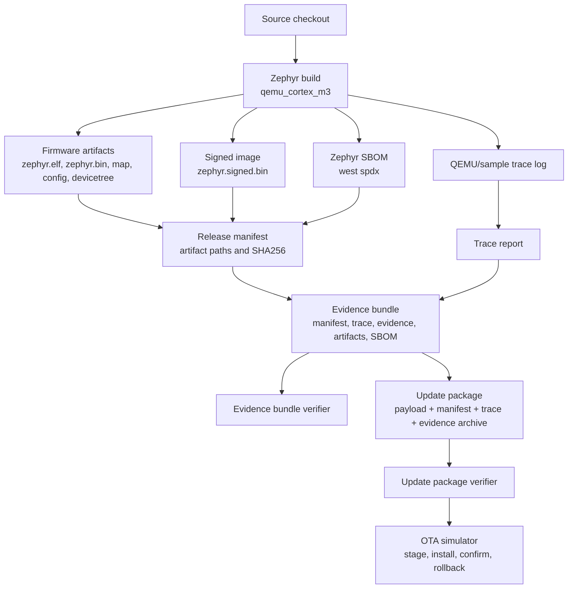
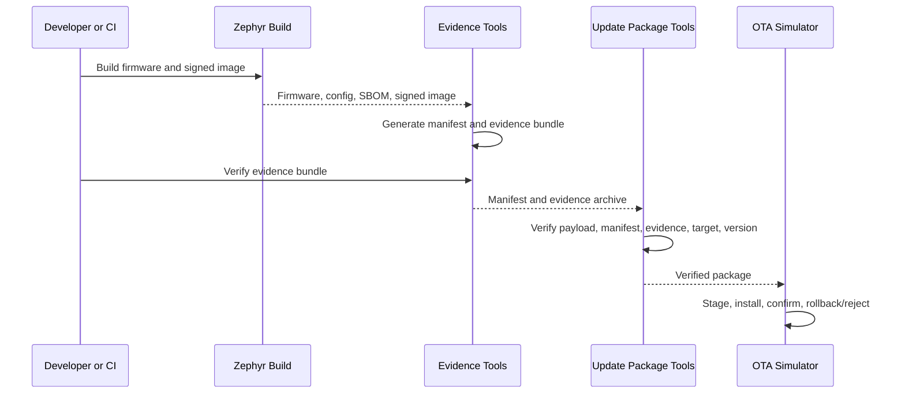

# Release Assurance Flow

This document describes the simulator-first AssureLoop alpha workflow. It is a
local release assurance flow for Zephyr firmware, not a production OTA service
or certified secure boot deployment.

## End-To-End Flow



## Step Details

### 1. Zephyr Build

The baseline simulator build is:

```bash
west build -b qemu_cortex_m3 firmware/app
```

It produces build output under `build/zephyr/`. The current evidence tooling
collects available files such as `zephyr.elf`, `zephyr.bin`, `zephyr.map`,
`.config`, and `zephyr.dts`.

### 2. Signed Image

The signed-image demo builds a simulator application image with Zephyr's
MCUboot/imgtool signing support:

```powershell
.\scripts\signed-image-demo.ps1
```

```bash
bash scripts/signed-image-demo.sh
```

It creates or reuses an ignored local development key at
`keys/mcuboot-dev-rsa-2048.pem`, produces `build-signed/zephyr/zephyr.signed.bin`,
verifies that image with `imgtool verify`, and packages it as a
`firmware-signed-image` artifact.

This is MCUboot-compatible image-signing groundwork. It does not run a
production bootloader path under qemu and does not claim production secure boot.

### 3. SBOM

The firmware evidence demo can run Zephyr SPDX generation:

```powershell
.\scripts\firmware-evidence-demo.ps1 -GenerateSbom
```

```bash
bash scripts/firmware-evidence-demo.sh --generate-sbom
```

Generated SPDX documents are placed under `build/spdx/` and copied into the
evidence bundle when requested.

### 4. Release Manifest

The manifest records the release contract:

- product,
- version,
- target,
- build profile,
- generated timestamp,
- artifact paths,
- artifact kinds,
- artifact sizes,
- artifact SHA256 hashes,
- optional SBOM artifacts.

Manifest shape is validated by `schemas/release-manifest.schema.json`.

### 5. Evidence Bundle

The evidence bundle contains:

- `release-manifest.json`,
- `trace-report.json`,
- copied firmware artifacts,
- copied SBOM artifacts when present,
- starter requirements, test matrix, and security checklist evidence.

The bundle is written both as a directory and as an archive:

```text
dist/firmware-release/evidence-bundle/
dist/firmware-release/evidence-bundle.tar.gz
```

### 6. Evidence Verifier

The evidence bundle verifier checks:

- manifest exists,
- manifest passes schema validation,
- listed artifacts exist,
- SHA256 hashes match,
- trace report exists,
- expected evidence files exist,
- SBOM files exist when listed,
- optional manifest signature verification when a signature and public key are
  provided.

### 7. Update Package

The update package wraps a release bundle into a simulator update artifact:

```text
dist/firmware-release/update-package/
├── update-package.json
├── payload/
├── release-manifest.json
├── trace-report.json
├── evidence-bundle.tar.gz
└── sbom/
```

When a signed image is present, the package creator prefers
`firmware-signed-image` as the payload.

### 8. OTA Simulator

The OTA simulator is a local state machine. It verifies the update package
before staging or installing. State is written to:

```text
dist/ota-sim/state.json
```

The simulator records:

- `current_version`,
- `previous_version`,
- `target`,
- `staged_package`,
- `staged_version`,
- `installed_package`,
- `installed_version`,
- `confirmed`,
- `rollback_available`,
- `last_error`,
- `history`.

## Verification Boundaries



Each step is local and reproducible enough for alpha review, except for
time-bound fields such as generated timestamps and locally generated
development keys.

## Limitations

- No real OTA network transport is implemented.
- No cloud service is implemented.
- No physical board support is added in the alpha simulator path.
- Development keys are local and ignored by git.
- No production secure boot or certification claim is made.
